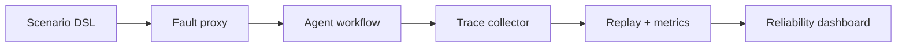

# ToolFault Atlas

**Chaos engineering for AI agents that depend on unreliable tools.**

**Live demo:** [deepak5039.github.io/toolfault-atlas](https://deepak5039.github.io/toolfault-atlas/)

ToolFault Atlas is an interactive reliability lab that injects production-style failures into a tool-using AI agent workflow, replays the resulting traces, and measures whether recovery logic actually works.

It is designed to answer a practical question: _what happens when the agent is fine, but its tools are not?_

## What the demo does

- Runs a deterministic refund-support agent through six failure scenarios.
- Injects timeouts, rate limits, schema drift, stale data, and partial writes.
- Compares a selected recovery strategy against a naive baseline using the same seeded runs.
- Measures task success, recovery rate, p95 latency, tool-call efficiency, and estimated execution cost.
- Replays a representative trace event by event.
- Exports a complete JSON experiment report for inspection or CI usage.

## Recovery strategies

| Strategy | Retries | Validation | Write verification | Fallbacks | Circuit breaker |
|---|---:|---:|---:|---:|---:|
| Naive agent | 0 | No | No | No | No |
| Guarded retry | 2 | Yes | Yes | No | Yes |
| Adaptive recovery | 3 | Yes | Yes | Yes | Yes |

## Architecture



The browser-based simulator is deliberately deterministic. A scenario, severity, strategy, episode count, and seed always produce the same report. This makes comparisons reproducible and keeps the public demo free to operate.

## Run locally

Requirements: Python 3 or any static file server; Node.js 20+ for tests.

```bash
git clone https://github.com/Deepak5039/toolfault-atlas.git
cd toolfault-atlas
npm test
npm run serve
```

Open `http://localhost:4173`.

## Test

```bash
npm test
npm run check
```

The test suite covers deterministic replay, healthy-path success, recovery improvements under timeout and schema-drift failures, and metric bounds.

## Repository structure

```text
dist/
  index.html       # Product UI
  styles.css       # Responsive visual system
  app.js           # Dashboard interactions and report rendering
  simulator.mjs    # Deterministic fault-injection engine
tests/
  simulator.test.mjs
.github/workflows/
  pages.yml        # GitHub Pages deployment workflow
```

## Why this is different

Most agent demos only show successful tool calls. ToolFault Atlas starts where those demos stop: contract drift, degraded dependencies, partial writes, retry storms, and measurable recovery behavior. It demonstrates agent design, evaluation, observability, fault modeling, and production trade-offs in one inspectable project.

## Scope and limitations

The public version uses a deterministic simulator rather than paid model or third-party API calls. Its metrics are engineering signals for comparing strategies, not guarantees about a real production system. The same simulator can later be wrapped around live tools through an HTTP proxy and OpenTelemetry spans.

## License

MIT
